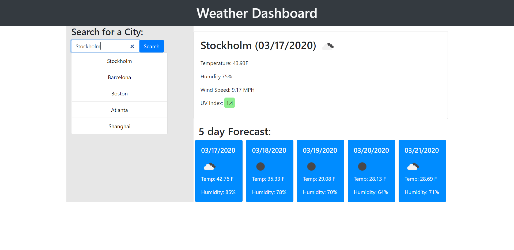

# Homework-06 Weather Dashboard

## Description
Weather dashboard is a web application that gives the current weather conditions for cities. The user is also presented with a five day forecast. City searches are saved in a history that allows quick access to that city's weather info. Upon refresh the page will show the weather info fo the city last searched by the user. It's easy to to with a responsive design good for any device. 

## Screenshots

## Resources 
Bootstrap was used for a majority of the CSS. Moment.js was used for date formatting. Open Weather API was used to get all weather data.

## Link
Deployed application: https://drospond.github.io/Weather-Dashboard/